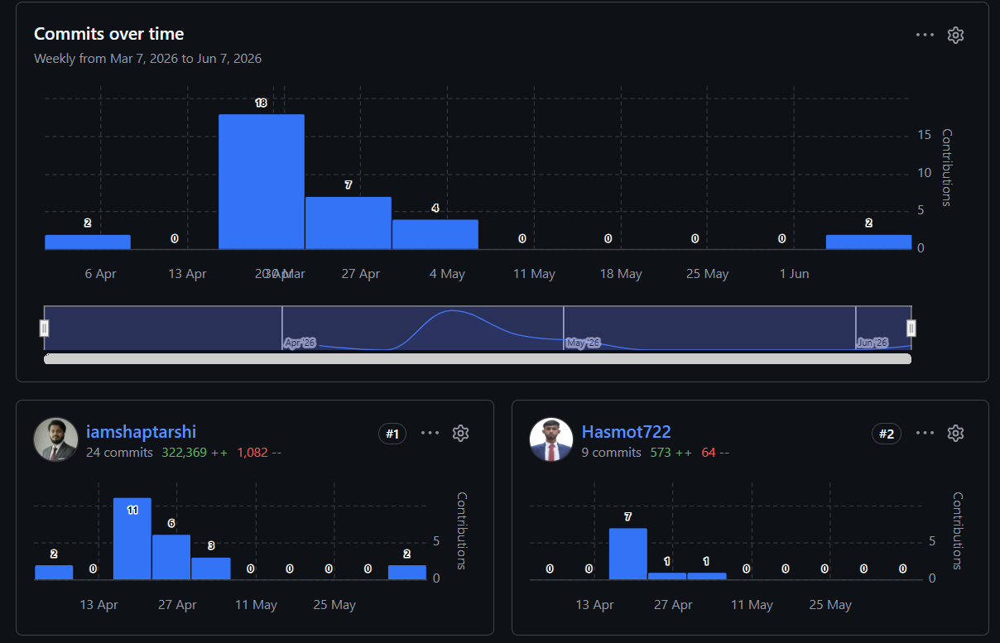

## 📌 Project Overview

The RUMC Smart Health Portal is a paperless medical management solution that improves healthcare accessibility, efficiency, and patient experience by integrating multiple hospital services into a single platform.

---
```text
(No Role Based Login System Implemented)
For Patient- localhost:5173/
For Doctor Dashboard- localhost:5173/dashboard
```

---
## 🚀 Features Implemented

| 👤 Patient Module          | 👨‍⚕️ Doctor Module          | 📊 Additional Features       |
| -------------------------- | ---------------------------- | ---------------------------- |
| Profile Management         | View Scheduled Appointments  | Responsive UI                |
| Online Appointment Booking | Manage Patient Records       | Real-Time Dashboard Updates  |
| Appointment History        | Create Digital Prescriptions | Centralized Medical Records  |
| Medical Record Access      | Update Appointment Status    | Medicine Tracking            |
| Lab Report Tracking        | Check Availability Schedule  | Emergency Service Management |

---

## 🏗️ Tech Stack

| Layer           | Technology          |
| --------------- | ------------------- |
| Frontend        | React.js            |
| Routing         | React Router        |
| HTTP Client     | Axios               |
| Styling         | Tailwind CSS        |
| Language        | JavaScript (ES6+)   |
| Backend         | Node.js, Express.js |
| Database        | MongoDB             |
| Version Control | Git, GitHub         |

---

---

## ⚙️ Installation & Setup

### 1️⃣ Clone the Repository

```bash
git clone <repository-url>
cd RUMC-Smart-Health-Portal
```

---

### 2️⃣ Install Frontend Dependencies

```bash
cd Client
npm install
```

---

### 3️⃣ Install Backend Dependencies

```bash
cd ../Server
npm install
```

---

## ▶️ Running the Project

### Start Backend

```bash
cd Server
node server.js
```

Backend will run on:

```text
http://localhost:3000
```

---

### Start Frontend

```bash
cd Client
npm run dev
```

Frontend will run on:

```text
http://localhost:5173
```

---

## 📈 Group Contribution Report

The following chart shows team contributions throughout the project development period.



---

## 👥 Team Members

| Member | Contributions |
|----------|--------------|
| Md. Shaptarshi | Documentation, UI Design, Frontend Development, Backend APIs, Database Integration |
| Md. Hasmot Ali | Login Page, About Page Design|

---

## 📄 License

This project is developed for academic and educational purposes.

---